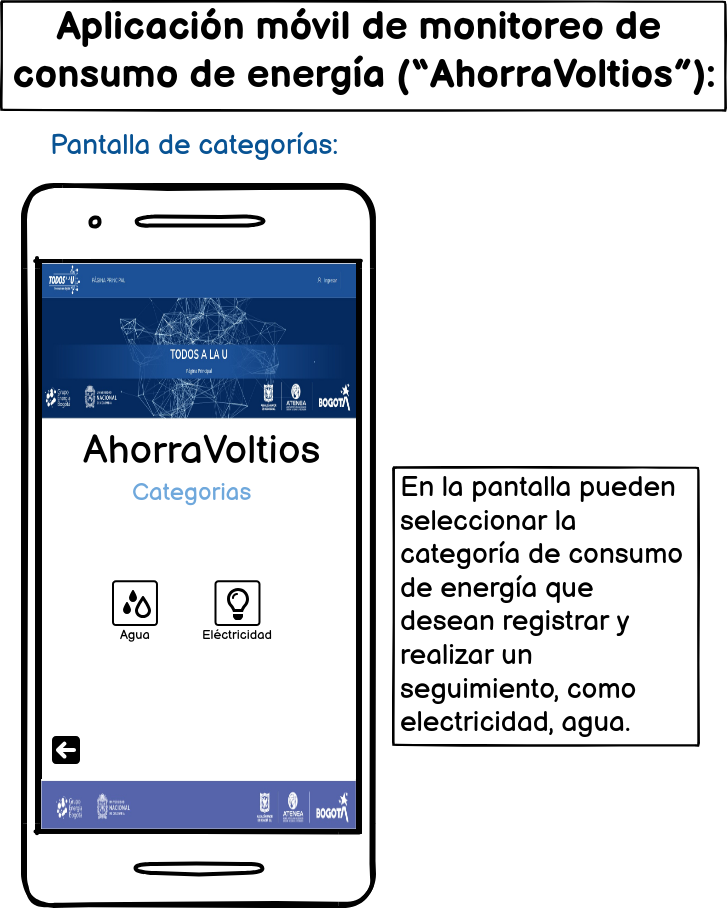

# ahorravoltios
## Aplicación móvil de monitoreo de consumo de energía (“AhorraVoltios”): 
Crea una aplicación que permita a los usuarios registrar y realizar un seguimiento de su consumo de energía en diferentes categorías (electricidad, agua, gas, etc.). Utiliza variables, operaciones y estructuras de datos para calcular y mostrar estadísticas, como el consumo promedio, comparativas entre períodos y consejos para reducir el consumo.
se sugiere tener las siguientes vistas:
### Pantalla de inicio de sesión: 
Permite a los usuarios iniciar sesión en la aplicación utilizando sus credenciales o registrarse como nuevos usuarios.
### Pantalla principal: 
Muestra la información general del consumo de energía, como el consumo promedio actual y comparativas entre períodos anteriores.
### Pantalla de categorías: 
Permite al usuario seleccionar la categoría de consumo de energía que desea registrar y realizar un seguimiento, como electricidad, agua, gas, etc.
### Pantalla de registro: 
Permite al usuario ingresar los datos de consumo de energía para una categoría específica, como la cantidad de electricidad consumida en kilovatios por hora (kWh).
### Pantalla de estadísticas: 
Muestra estadísticas detalladas sobre el consumo de energía, como el consumo promedio, máximo y mínimo para una categoría específica.
### Pantalla de consejos: 
Proporciona consejos y recomendaciones personalizadas para reducir el consumo de energía en función de los datos registrados.
Además de estas vistas, se necesitarán funciones y métodos para realizar cálculos y manipulaciones de datos, como calcular estadísticas, realizar comparativas y buscar elementos en estructuras de datos como ArrayList y HashMap. También se requerirá el uso de condicionales (if, when), ciclos (for, while) y conceptos de programación orientada a objetos, como clases, herencia y polimorfismo.

## Solución 

| Figura | Figura | Figura |
|--------|--------|--------|
| | | |
| | | |
| | | |
| | | |
| | | |